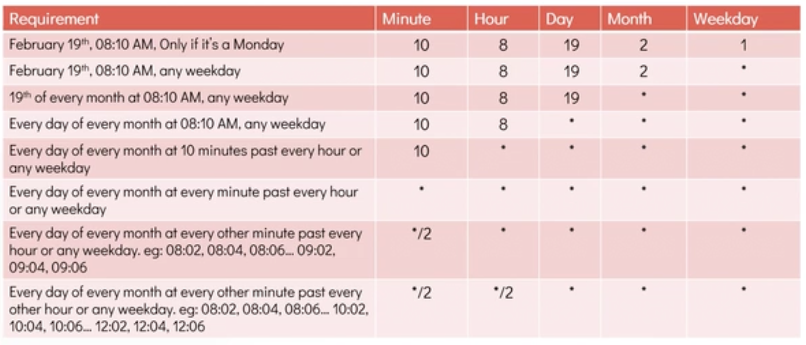

# Cronjob in Linux

  - Take me to the [Tutorial](https://kodekloud.com/courses/873064/lectures/24032686)
  - In this lecture we will learn about **Cronjobs** in Linux .


The basic usage of **cron** is to execute a job in a specific time. The **`crontab`** is a list of commands that you want to run on a regular schedule, and also the name of the command used to manage that list. **Crontab** stands for **`cron table`** because it uses the job scheduler cron to execute tasks. The schedule is called the crontab, which is also the name of the program used to edit that schedule.

## Linux Crontab Format

   

### Expressions used and Description

   
   
   

#### Crontab commands

    
   

#### View registered crons
- To see the registered cron
```bash
[michael@caleston-lo01 ~]$ crontab -e
# Notice that tasks will be started based on the cron's system 
# daemon's notion of time and timezones.
#
# Output of the crontab jobs (including errors) is sent through email
# to the user the conrtab file belongs to (unless redirected).
#
# For example, you can run a backup of all your use accounts at 5.am every week wuth:
# 0 5 * * 1 tar -zcf /var/backups/home.tgz /home/
#
# For more information, see the manual pages of crontab(5) and cron(8)
#
# m  h  dom mon dow command
# 0  21  *   *   *   uptime >> /tmp/system-report.txt
#
```

```bash
[michael@caleston-lo01 ~]$ cat /tmp/system-report.txt
21:00:00 up 20:15, 1 user, load average: 0.47, 0.50, 0.50
```

```bash
[michael@caleston-lo01 ~]$ tail /var/log/syslog
Jul 22 21:00:01 caleston-lp10 CRON[1720]: (michael) CMS (uptime >> /tmp/system-report.txt)
```

#### Table Reference

	 

##### Crontab Examples

*/30 * * * *	Every 30 mins

0 * * * *	Every hour

0 0 * * 0	At midnight of every Sunday

0 0 0 15 * *	Every 15th of month (monthly)

0 0 0 1 1 *	Every 1st of january (yearly)

@reboot	        Every reboot
